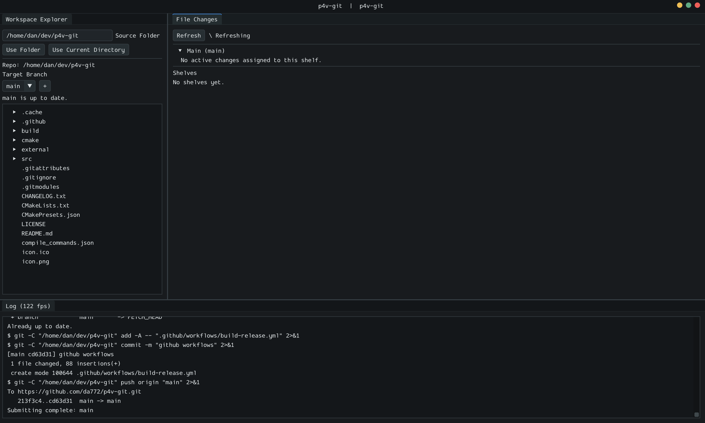

# p4v-git

[](https://github.com/da772/p4v-git/actions/workflows/release-build-check.yml)
[](https://github.com/da772/p4v-git/actions/workflows/build-release.yml)


`p4v-git` is a cross-platform desktop Git client inspired by Perforce P4V. The goal is to provide a familiar workspace-oriented UI for browsing a repository, organizing active file changes into shelves, reviewing shelf diffs, opening/merging pull requests, and submitting changes back to a selected target branch.

Current version: `0.3.0`

The application is built with C++20, CMake, GLFW, Vulkan, and Dear ImGui docking.



## CI Status

| Workflow | Result | Coverage |
| --- | --- | --- |
| Release Build Status | [](https://github.com/da772/p4v-git/actions/workflows/release-build-check.yml) | Every two hours, verifies Linux and Windows release builds for changed `main` and open pull request SHAs that have not already passed. |
| Build Release Artifacts | [](https://github.com/da772/p4v-git/actions/workflows/build-release.yml) | Manually builds Linux and Windows release executables and publishes a GitHub release. |

## Features

- P4V-style Workspace Explorer, File Changes, and Log panels while keeping Git as the source-control backend.
- File checkout intent that lets users group local Git changes into Perforce-like shelves without staging files directly.
- Shelf workflows backed by Git branches and GitHub pull requests, including shelve, submit, link, restore, revert, and delete actions.
- Target-branch selection so teams can submit shelves into the branch they actually use, not only `main`.
- Active change lists that support multi-select, drag/drop between shelves, and VS Code diffs.
- Background Git/GitHub operations with visible UI busy states so the app feels like a desktop client instead of a command wrapper.

## Prerequisites

- CMake 3.24 or newer
- Git command line client, including access to `git` on `PATH`
- curl command line client, including access to `curl` on `PATH`
- Vulkan SDK or Vulkan development packages
- A C++20 compiler and platform build tools
  - Linux: Clang, clang++, pkg-config, Vulkan loader/dev headers, X11 and Wayland development packages
  - Windows: Visual Studio 2022 or newer with the Desktop development with C++ workload, Windows SDK, and LunarG Vulkan SDK with `VULKAN_SDK` set
  - macOS: Xcode command line tools or Apple Clang and the LunarG Vulkan SDK with `VULKAN_SDK` set
- Optional: Ninja for the Linux preset and direct `ninja -C build Debug` style builds
- Optional: VS Code command line launcher (`code`) for opening file diffs and merge/review folders from the app

Ubuntu/Debian dependency example:

```sh
sudo apt-get update
sudo apt-get install -y \
  git \
  curl \
  cmake \
  clang \
  pkg-config \
  libvulkan-dev \
  xorg-dev \
  libwayland-dev \
  wayland-protocols \
  libxkbcommon-dev
```

## Setup

Clone dependencies:

```sh
git submodule update --init --recursive
```

Configure:

```sh
# Default generator
cmake -S . -B build

# Optional Linux Ninja generator
cmake --preset linux-clang-ninja
```

Build:

```sh
# Any generator
cmake --build build --config Debug

# Optional Ninja config targets
ninja -C build Debug
ninja -C build Release

# Or from inside build/
ninja Debug
ninja Release
```

Run:

```sh
# Windows
.\build\Debug\p4v-git.exe

# Linux
./build/Debug/p4v-git

# macOS
./build/p4v-git
```

## Disclaimer

This project is provided as-is, without warranty of any kind. Use it at your own risk. The maintainers are not responsible for code breakage, data loss, machine issues, workflow disruption, or other damages that may result from building, running, modifying, or using this software.

See `CHANGELOG.txt` for versioned changes.
